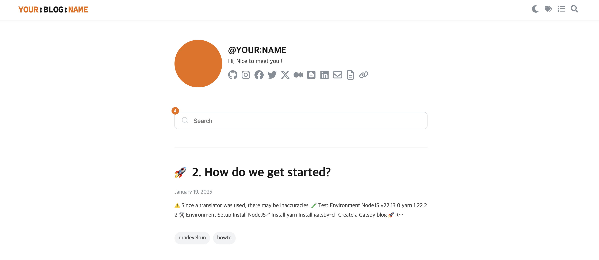

# gatsby-starter-rundevelrun

A minimal, SEO-friendly Gatsby blog starter — perfect for developers who want a clean, fast, and customizable blog setup.



> 🇰🇷 [한국어 README 보기](README)

## 🚀 Features

- 📝 Markdown-based content
- ⚡ Blazing-fast performance (Gatsby + GraphQL)
- 🧠 SEO optimized with meta tags and schema.org
- 💻 Fully responsive, mobile-friendly
- 🌙 Dark mode toggle
- 😍 ***Free Real-time Visitor Counter and Dashboard Support***
  - [free-visitor-counter-api-dashboard](https://github.com/rundevelrun/free-visit-counter-api-dashboard)
  - [free-visitor-counter-npm-package](https://github.com/rundevelrun/free-visit-counter)

## 👀 Demo

👉 [Live Demo](https://6developer.com)

This blog starter powers [6developer.com](https://6developer.com), a developer-focused tech blog.

## 🛠️ Quick Start

```bash
gatsby new my-blog https://github.com/rundevelrun/gatsby-starter-rundevelrun
cd my-blog
gatsby develop
```

## 🧩 Who is this for?

This starter is ideal for:

- Developers who want to focus on writing, not setup.
- People looking for a minimal yet powerful blog.
- Those who care about SEO and performance.

## 🖼️ Showcase

Have you built something with this starter? Add your blog here via Pull Request!

- [6developer.com](https://6developer.com)
- [pang-ho.github.io](http://pang-ho.github.io/)

## 📚 Documentation

- [How to write posts](docs/writing.md) 
- [How to customize the theme](docs/customization.md)
- [Deployment guide](docs/deploy.md) 

## 🙌 Contributing

Contributions welcome! Feel free to submit PRs or open issues.

## ⭐ Star History

<a href="https://www.star-history.com/#rundevelrun/gatsby-starter-rundevelrun&Date">
 <picture>
   <source media="(prefers-color-scheme: dark)" srcset="https://api.star-history.com/svg?repos=rundevelrun/gatsby-starter-rundevelrun&type=Date&theme=dark" />
   <source media="(prefers-color-scheme: light)" srcset="https://api.star-history.com/svg?repos=rundevelrun/gatsby-starter-rundevelrun&type=Date" />
   
 </picture>
</a>

If you find this useful, please consider starring the project ⭐️
